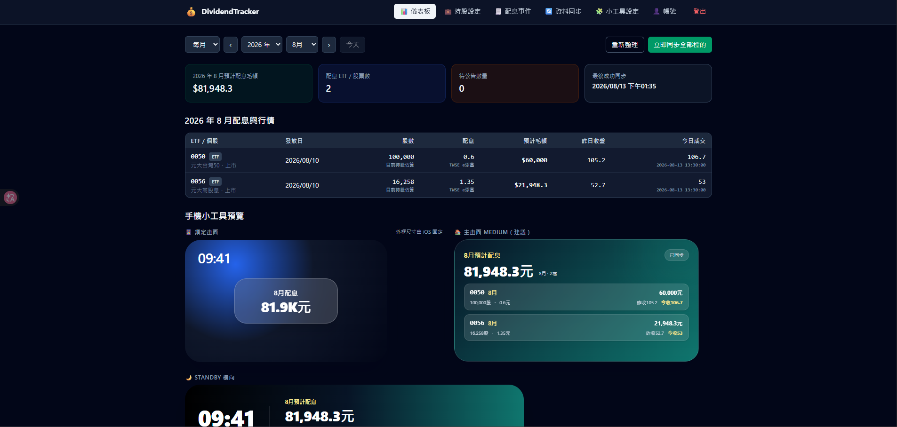
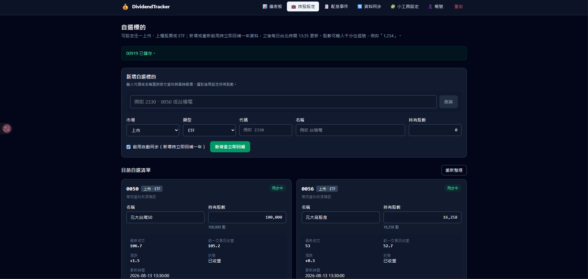
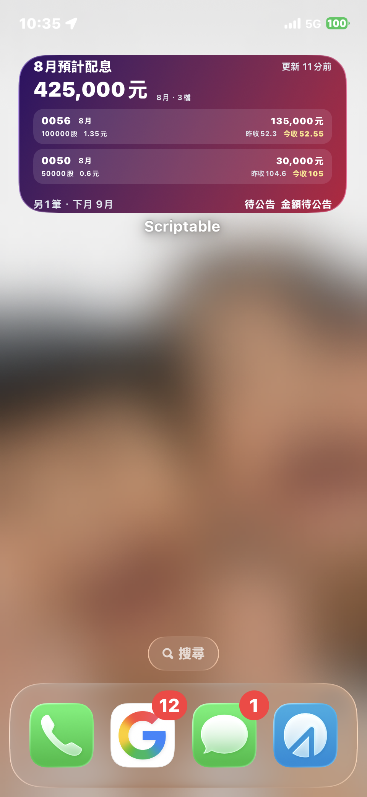
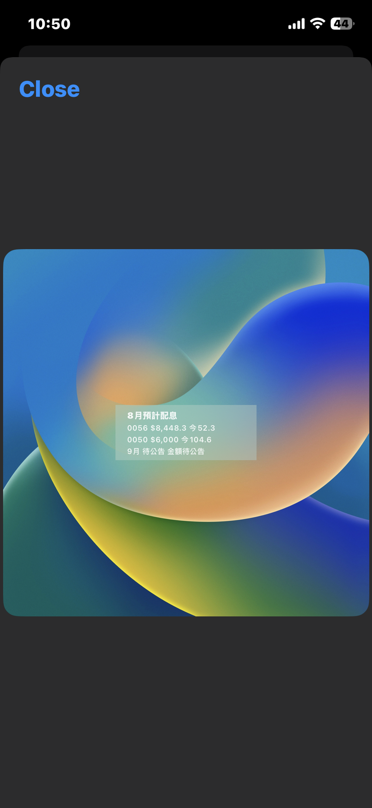

# DividendTracker

DividendTracker 是以 Cloudflare Workers、D1 與 Scriptable Widget 建立的多使用者股利追蹤工具。公開市場資料共用，持股、股利覆寫、Widget 外觀與帳號資料依使用者隔離。

## 畫面展示

### Web 儀表板與持股設定

<p align="center">
  <a href="./docs/images/showcase/dashboard-and-widget-preview.png">
    
  </a>
</p>

<p align="center">
  <a href="./docs/images/showcase/portfolio-settings.png">
    
  </a>
</p>

### iPhone Scriptable Widget

<p align="center">
  <a href="./docs/images/showcase/iphone-home-widget.png">
    
  </a>
  &nbsp;&nbsp;
  <a href="./docs/images/showcase/scriptable-widget-preview.png">
    
  </a>
</p>

點擊圖片可查看原始尺寸。

## 目前功能狀態

- Web 儀表板、帳號／權限、多使用者資料隔離、台股 ETF 與個股持股管理均可使用。
- 公開市場資料每日完整同步，行情每個整點更新；每日工作若中斷，會在 30 分鐘 lease 到期後自動重試，舊版誤寫的完成標記也會和實際成功紀錄核對，不會再因「先標記、後失敗」而卡住整天。
- owner 可直接在「資料同步」頁調整台北每日同步時間，不必重新部署。
- Scriptable Widget 支援主畫面與鎖定畫面、背景／排序／更新間隔設定，並顯示實際台北同步時間，例如 `同步 2026/08/14 13:35`，不再顯示「更新 X 小時前」。
- Windows、Linux 均提供引導式安裝檔；Cloudflare Worker、D1、migration、Secret 與健康檢查會自動完成。

## 傻瓜安裝（推薦）

安裝過程只需要依終端機提示操作。Cloudflare 授權時會開啟瀏覽器；若尚未有帳號，可在該頁先免費註冊，再登入並按下 Allow／授權。安裝器不需要 GitHub CLI。

### Windows 10／11

開啟 PowerShell，貼上：

```powershell
Set-ExecutionPolicy -Scope Process Bypass
Invoke-WebRequest https://raw.githubusercontent.com/InchIK/DividendTracker/main/install.ps1 -OutFile "$env:TEMP\DividendTracker-install.ps1"
& "$env:TEMP\DividendTracker-install.ps1"
```

安裝器會在需要時透過 `winget` 安裝 Git 與 Node.js LTS（Node.js 22 以上），預設將程式放在使用者目錄的 `DividendTracker`。

### Linux

開啟終端機，貼上：

```bash
installer=/tmp/dividendtracker-install.sh
curl -fsSL https://raw.githubusercontent.com/InchIK/DividendTracker/main/install.sh -o "$installer"
bash "$installer"
```

支援 apt、dnf、yum、pacman 與 zypper。缺少 Node.js 22 時，會透過固定版本的官方 nvm 安裝在目前使用者帳號，不會取代其他使用者的環境。若系統沒有 `curl`，也可用瀏覽器下載 [`install.sh`](./install.sh) 後執行 `bash install.sh`。

### 安裝器會做什麼

1. 檢查並安裝 Git、Node.js 22+、npm。
2. 取得 DividendTracker 並安裝 npm 套件。
3. 引導完成 Cloudflare 註冊／登入與 Wrangler OAuth 授權；多個 Cloudflare 帳戶時會要求選擇。
4. 產生每次安裝獨立的 Worker 名稱、D1 名稱與加密金鑰，建立 D1、套用全部 migration，再部署 Worker。
5. 驗證線上 `/health` 與登入設定，儲存本機安裝狀態並開啟上線網址。
6. 第一次安裝時，提示在瀏覽器建立第一個 owner 帳號。

可先查看計畫而不安裝、不連線或寫入檔案：Windows 使用 `install.ps1 -DryRun`，Linux 使用 `bash install.sh --dry-run`。

## 部署資料不進 GitHub

正式環境的 Cloudflare account ID、D1 ID、Worker 名稱／網址、加密金鑰與安裝狀態只會寫入本機的 `settings.json`、`wrangler.generated.jsonc`、`.dev.vars`、`.setup-cloudflare-state.json`；這些檔案全部被 `.gitignore` 排除，清理指令也只會處理本機檔案。

此外，部署隱私檢查會掃描目前追蹤內容、build 與所有可達 Git 歷史。即使使用 `git add -f` 強制加入生成檔，Cloudflare ID、正式 Worker URL、安裝專屬資源名或 Token 仍會讓檢查失敗：

```bash
npm run check:deployment-privacy
```

GitHub repository URL 與 commit 作者身分屬於公開 GitHub 身分，不被當成「部署環境資料」；一般個資掃描仍會另外檢查 email、使用者路徑等項目。

## 開發者手動安裝

```bash
git clone https://github.com/InchIK/DividendTracker.git
cd DividendTracker
npm install
npm run setup
npm run config:generate
npm run dev
```

要建立或重新部署 Cloudflare 資源：

```bash
npm run setup:cloudflare
```

全新設定會先登入 Cloudflare，再依序檢查同名 Worker 與 D1；只有兩者都不存在才建立資源。任何同名資源或無法判定的 API 錯誤都會安全停止，不會重用、接管或刪除既有資源。既有安裝會使用本機 `settings.json` 內明確的 D1 ID，重新套用尚未執行的 migration 並部署。

第一次註冊的帳號是全新空白 owner，不會接管其他部署或舊資料。

### FinMind 配額（可選）

FinMind 官方目前的配額為：已驗證 FinMind 帳號並搭配 API Token，每小時 600 次；匿名呼叫每小時 300 次。詳見[登入與 Token 說明](https://finmind.github.io/login/)及[API 使用次數](https://finmind.github.io/api_usage_count/)。

正式環境如需提高配額，請在專案目錄執行互動式命令：

```bash
npx wrangler secret put FINMIND_API_TOKEN --config wrangler.generated.jsonc
```

請只在 Wrangler 的隱藏提示中貼上 Token，絕不要將 Token 寫入原始碼、設定檔、Wrangler 設定、命令列參數或 Git。未設定時 Worker 仍會以匿名方式運作。

## Widget

在 Dashboard 的 Widget 頁面按下下載時：

1. 先驗證目前帳號密碼。
2. 取得乾淨腳本，輪替一次全新 Widget Token，並建立新的 installation ID。
3. 將目前頁面 Origin、新 Token 與 installation ID 嵌入腳本，再測試連線成功後才下載。

每按一次下載，先前下載的 Widget 會立即失效。頁面不顯示、不複製、不重用 Token，也不接管舊 Keychain 或舊 cache。背景、排列方式與更新間隔保存在 D1，既有 Widget 會在下次更新時套用，不必重新下載；只有更換連線憑證時才需要下載新腳本。Widget 的預覽只使用中性欄位標籤。

owner 可在「資料同步」頁調整每日完整同步的台北時間，不必重新部署；行情仍於每個整點更新。完成標的設定後會立即回補至少一年資料，並支援全台 ETF 與股票的動態設定。Widget 上方的同步標籤是最近一次成功／部分成功完整同步的台北實際時間，不是 iOS 喚醒時間或行情時間。

## 隱私與安全檢查

```bash
npm run check:privacy:current
npm run check:privacy
npm run check:deployment-privacy
npm run check
```

Build 會在清理產物後執行 tracked／build 個資掃描與部署資料歷史掃描。要額外檢查 Git 作者身分，請執行：

```bash
node scripts/check-personal-data.mjs --history
```

掃描器只能降低誤提交風險，不能取代真正的 secret management、金鑰輪替與權限控管。

## 主要指令

```bash
npm run setup
npm run setup:cloudflare
npm run db:migrate:local
npm run build
npm run test:e2e
npm run clean:personal-data -- --confirm
```

`clean:personal-data` 只刪除工作區內經過驗證的本機生成設定、建置產物與報告，絕不刪除 Cloudflare 遠端資源。

## 文件

- [手動步驟](./MANUAL_STEPS.md)
- [多使用者架構](./docs/MULTI_USER_ARCHITECTURE.md)
- [技術開發指南](./docs/TECHNICAL_DEVELOPMENT_GUIDE.md)
- [資料來源](./docs/DATA_SOURCES.md)
